# Gérer un projet SCRUM

---

## Modalités

1. En binôme ou trinôme
2. Créez un projet SCRUM sur Jira
3. Reprendre les tickets du product backlog ci-après (photos)
4. Versionnez votre code avec Git
5. Présentation d'un ou plusieurs incréments opérationnels l'après-midi du dernier jour de la formation lors de la Sprint Review qui sera suivi par un Sprint Retrospective
6. Définissez votre objectif de sprint sur Jira, tenez à jour Jira.
7. N'oubliez pas d'apporter de la valeur et la notion du MVP pour votre sprint
8. Respectez la Definition Of Done ci-dessous 

---

## Definition of Done

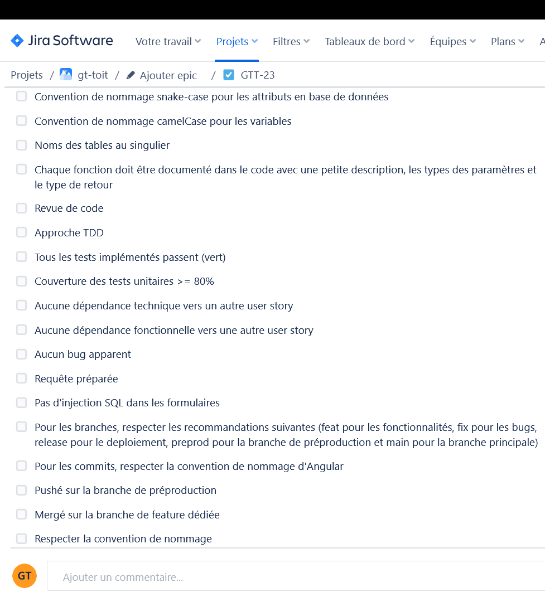

---

## Product Backlog

Le Product Owner a constitué le Product Backlog ci-après.
Ce Product Backlog comme nous l'avons vu dans le cours sur la gestion de projet peut évoluer. **Libre à vous de partir de cette base et d'en faire ce que vous voulez pour définir un objectif de Sprint. Autrement dit, vous pouvez ajouter/modifier/supprimer des éléments**.

---

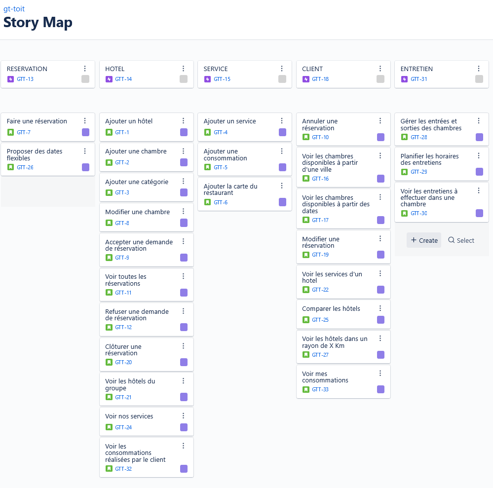

---

---

---

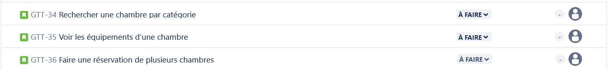

---

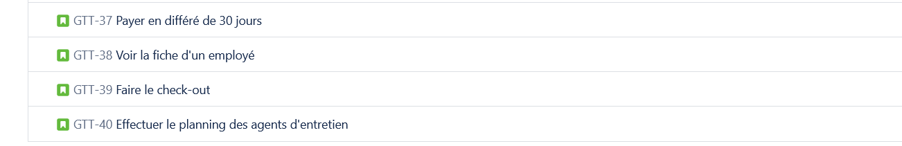

---

## Personas

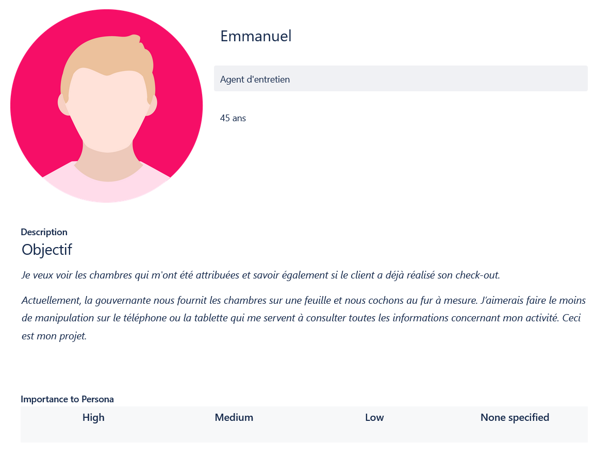

---

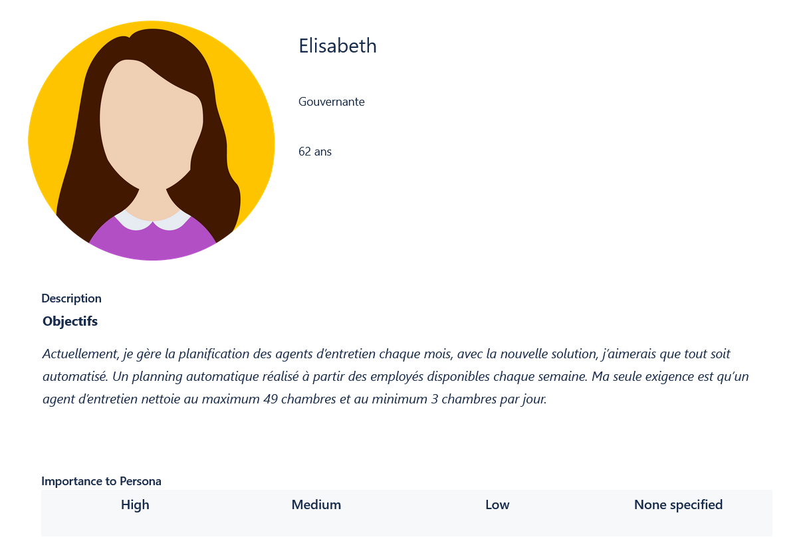

---

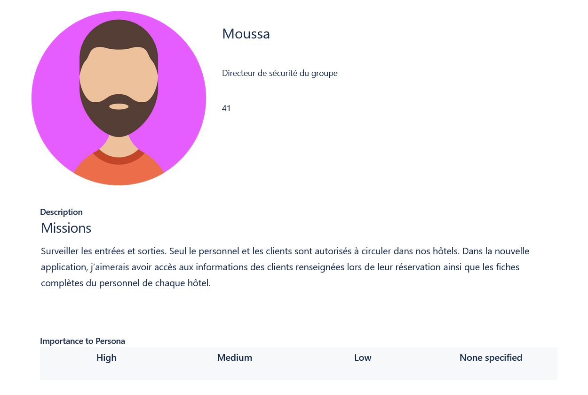

---

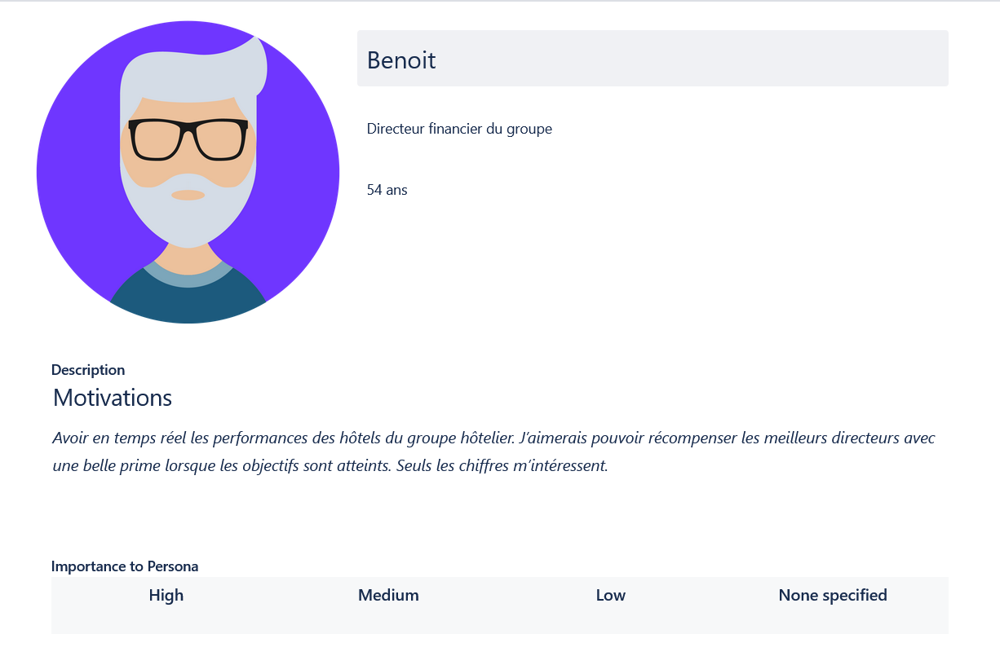

---

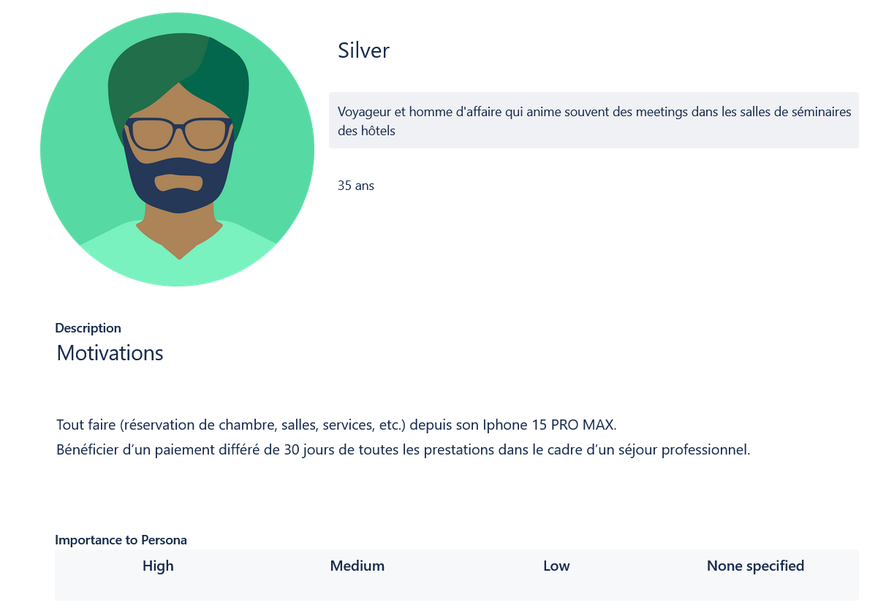

---

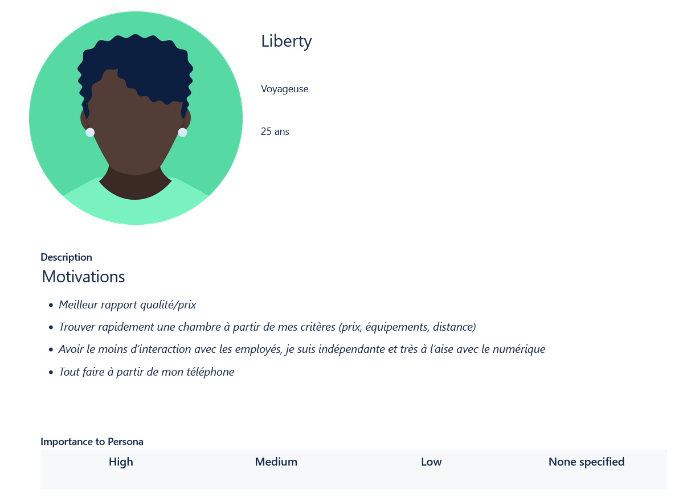

---

## Expression des besoins du groupe hôtelier Gouvernance Hôtel

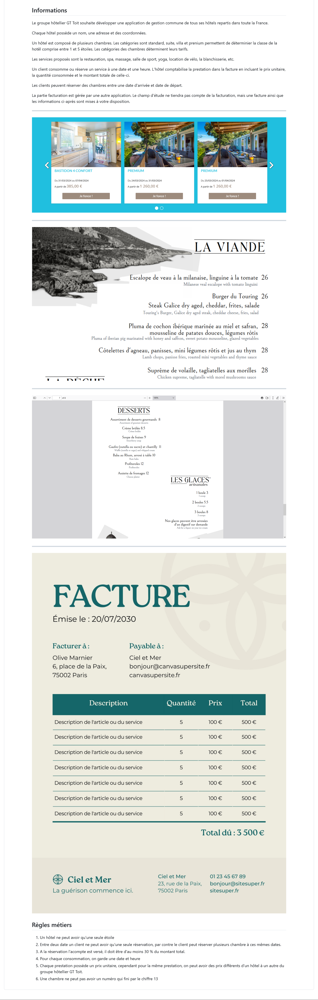