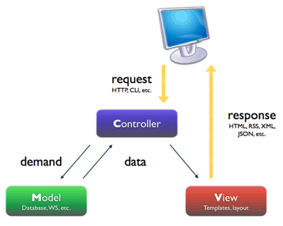
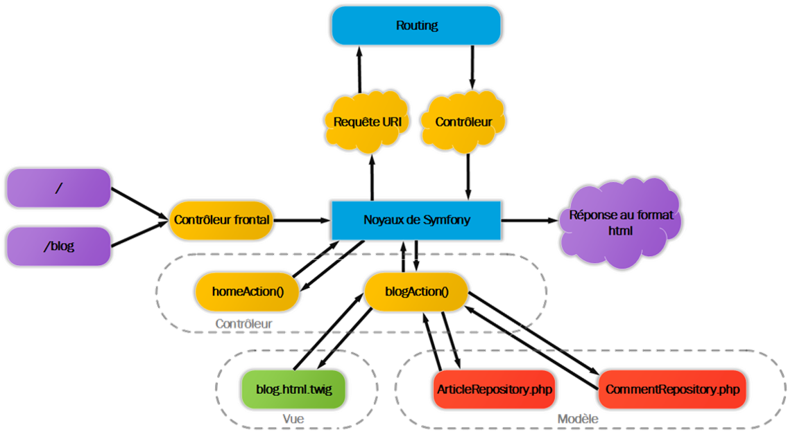
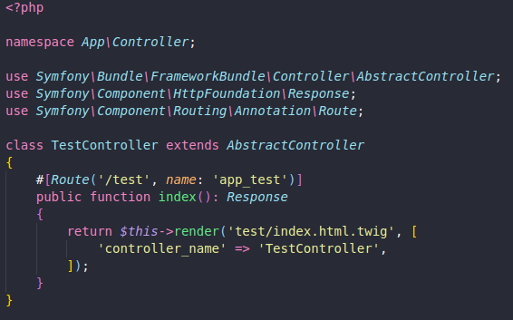
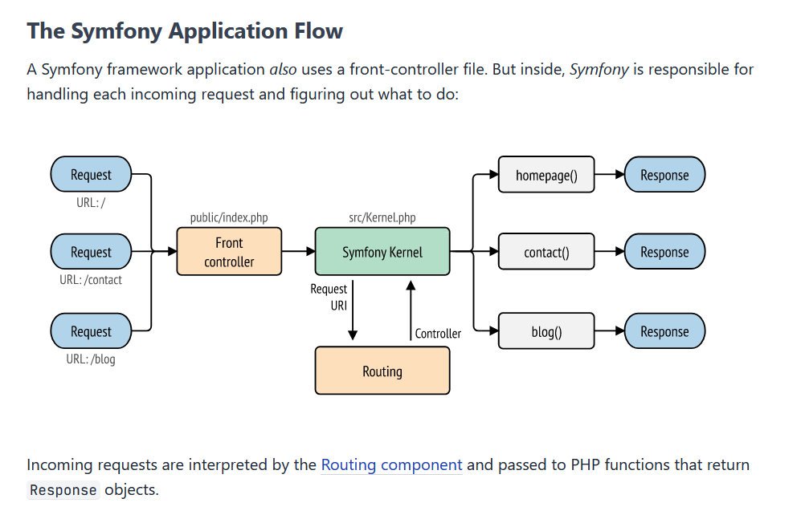

# Contrôleur

## Caractéristiques

- Le C de l’architecture MVC
- Son rôle de recevoir une requête, de le traiter en communiquant avec les autres composants (Modèle et Vue) pour retourner une réponse au Client
- Le fichier ***src/Kernel.php*** contient le noyau du framework, c’est-à-dire le fichier qui permet de rediriger les requêtes HTTP d’un client vers le bon contrôleur qui se chargera de répondre .
- Une requête HTTP est d’abord interceptée par le contrôleur frontal public/***index.php***
- public/index.php
 - Est le point d’entrée d’une application Symfony
 - Intercepte une requête HTTP
 - Transmets au Kernel la requête

source image [https://symfony.com/legacy/doc/jobeet/1_2/en/04?orm=Propel](https://symfony.com/legacy/doc/jobeet/1_2/en/04?orm=Propel)

---

## Routing

- Source image [http://igm.univ-mlv.fr/~dr/XPOSE2014/Symfony/structure.html](http://igm.univ-mlv.fr/~dr/XPOSE2014/Symfony/structure.html)

---

## Fonctionnement

- Retourne un objet Response
- Généré un contrôleur depuis le CLI
`php bin/console make:controller NameOfMyControllerWithSuffixController`

- Une classe PHP qui hérite de la classe ***AbstractControl***
- Possède une ou plusieurs méthodes qui sont associées à chaque fois à une route.
- Le contrôleur n’implémente pas les responsabilités (fonctions) liées à la vue (HTML, CSS, JS)  ni au modèle (base de données), par contre, il appelle de ses composants qui se chargeront de fournir les templates et les données qui serviront à créer la page HTML à retourner au Client.

- Une méthode
 - Peut prendre en paramètre un objet Request (données de la requête cliente) via l'injection de dépendance
 - Peut prendre en paramètre un objet Response (données permettant de retourner une réponse)

Les fichiers suivants seront générés
- ***src/Controller/HelloWorldController.php***
- ***templates/helloworld/index.html.twig*** (l’option ***--notemplate***, empêche de générer la vue)

- Tous les contrôleurs se trouvent dans le *namespace* ***App\Controller***
L’annotation ***#[Route…]***
Définis la route associée à la méthode. Lorsque qu’un client fera une requête vers cette route la méthode sera exécutée
Peut prendre un nom ici app_test
On peut spécifier via la clé *methods={‘GET’, ‘POST’}* les méthodes HTTP supportées pour cette route à la suite de name

Source image [https://aymeric-cucherousset.fr/symfony-6-creer-un-controller/](https://aymeric-cucherousset.fr/symfony-6-creer-un-controller/)

### Request

- [Documentation](https://symfony.com/doc/current/components/http_foundation.html)

---

### Response

- [Documentation](https://symfony.com/doc/current/components/http_foundation.html#response)

---

### JsonResponse

- [Documentation](https://symfony.com/doc/current/controller.html#returning-json-response)