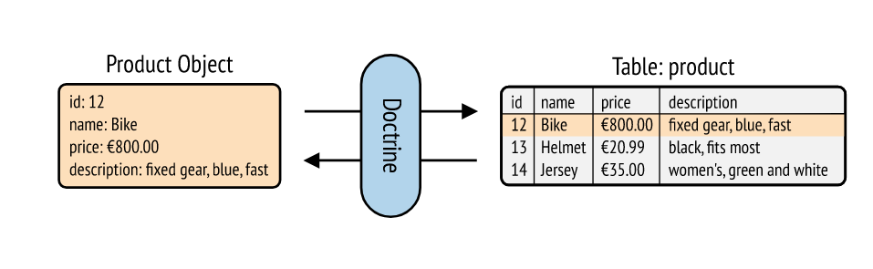

# Doctrine

## Documentation

- [Documentation Doctrine](https://symfony.com/doc/current/doctrine.html)

## Installation

`composer require symfony/orm-pack`

---

## Création de la base de données et des tables

Il faut au préalable configurer les informations depuis le fichier ***.env***
Ensuite, à la racine de votre projet, exécutez la command suivante dans le terminal
`php bin/console doctrine:database:create`

---

### Création des classes métiers

Dans l’architecture MVC, on crée des classes métiers qu’on appelle Entity qui représente les données côté métier afin de bien faire la distinction avec les autres classes techniques
Pour créer une classe métier depuis la console
Comme toujours s’assurer qu’on est à la racine du projet
`php bin/console make:entity`
Ensuite, se laisser guider en répondant aux questions
La classe est généré dans ***src/Entity***

---

### Création des entités dans la base de données

Une fois toutes les entités nécessaires au projet ont été créées, il suffit d’exécuter la commande

`php bin/console make:migration`

Doctrine va générer un ficher avec les requêtes SQL dans migrations.

Il faut ensuite aller vérifier que les fichiers qui sont générés répondent correctement à votre schéma de base de données
Une fois que tout est bon, il suffit d’exécuter la commande suivante pour créer vos tables dans la base de donnée

`php bin/console doctrine:migrations:migrate` 

---

### Modifier une entité déjà créée

`php make:entity name_of_entity_already_exists`

Comme précédemment se laisser guider

---

### Ajoutez des entrées dans une table

Depuis une méthode du contrôleur dédié, créer une instance de l’entité
Remplir les valeurs des champs à l’aide des setters
Utiliser l’entityManager $this->getDoctrine()->getManager(), une classe dédié pour la gestion de la base de données (BDD)
Elle possède des méthodes usuelles pour manipuler une BDD
Méthode persist($entity) : ajoute l’entité dans la liste des éléments qui seront persisté à l’appelle de la méthode flush
Méthode flush() : persiste les modifications dans la BDD

---

### Récupérer les enregistrement depuis la base de données (BDD)

Cette fois-ci, il faut faire appel au repository via Doctrine avec $this->getDoctrine()->getRepository(NameOfEntity ::class)
Le repository prend en paramètre le nom de la classe métier que l’on peut récupérer via NameOfEntity::class
Les méthodes du repository
findAll()
find(id)
findOneBy(associated_array)

### Créer ses propres méthodes pour manipuler la base de données (BDD)

C’est possible directement au niveau de la classe Repository dédié dans src/Repository

---

## Relier les entités à la création avec le type de champs relation

à la place de string, integer, etc, mettre relation.
Ensuite décider s'il s'agit d'une relation :
- ManyToOne
- OneToMany
- ManyToMany
- OneToOne

---

## Ajouter des données

On va utiliser l'objet REQUEST et ses méthodes pour récupérer des données envoyés depuis le client.

Combiné à Serializer on peut directement transformer par exemple des données envoyé en json en entité (objet) :
`$post = $serializer->deserialize($request->getContent(), Post::class, 'json')`

<!-- 
- ORM doctrine
- création base de données
- création tables
- entity manager
- commandes
- mapping classe métier avec les annotations
- persist()
- flush()
- remove()
- modifier une entité `php bin/console make:entity Article`
- Entity = classe qui matérialise le metier (données manipulés par les utilisateurs finaux)
- Repository = classe dédié à intérroger la base de données pour faire des opérations CRUD. -->