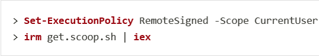
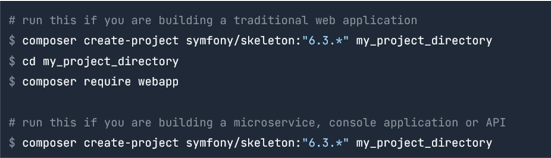
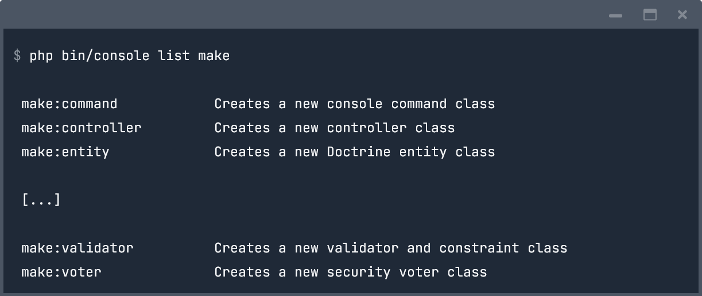

# Cours et documentation

---

## Les bases

- [A LIRE ABSOLUMENT les bases symfony](https://symfony.com/doc/current/introduction/http_fundamentals.html)

---

## Installation

- [Documentation officielle de symfony sur toutes les façons de l'installer](https://symfony.com/doc/current/setup.html)

PS: pour toutes les commandes commençant par symfony présenté dans ce document, vous devez au préalable ouvrir un terminal et vous positionner à la racine de votre projet.

### Avec Scoop

1. Ouvrez PowerShell (version >= 5.1)
2. Installez scoop un programme d’installation en ligne de commande Windows permettant d’installer permettant d’installer d’autres programmes
3. Exécutez dans l’ordre défini les instructions suivantes

Ensuite, exécutez `symfony new project_name` rajoutez l’option `--webapp` pour une application web ou `--full`

### Avec composer

Installez composer qui est un gestionnaire de paquet pour PHP depuis https://getcomposer.org/download/ (sur Windows prendre le fichier .exe)
Exécutez dans l’ordre défini les instructions suivantes

---

## Créer un projet

- Plusieurs templates existent :
 - web-skeleton pour une application web avec tous les bundles (modules) nécessaires tels que Doctrine, etc.`symfony new NameOfMyProject --web-skeleton`
 - simple pour créer des API, a commande à exécuté `symfony new NameOfMyProject`
 - etc.

---

## Exemple d'un projet sous symfony

`symfony new myDemoProject --demo`

Avec l'option ***demo***, vous allez installer le projet demo de symfony qui permet d'avoir un projet front et back avec les différents bundles de symfony.

---

## Lancer son projet et y accéder via l'URL localhost avec un port qui sera renseigné dans le terminal

- `symfony serve:start`
- ou `symfony serve -d`
- ou `symfony open:local`

---

## Quelques commandes

- Voir la liste de toutes les commandes : `php bin/console`
- Effacer le cache : `php bin/console cache:clear`
- Voir la liste de tous les services : `php bin/console debug:container`
- Voir toutes les classes ou interfaces qui peuvent être injecté dans les constructeurs ou méthodes des contrôleurs : `php bin/console debug:autowiring`
- Voir la liste des classes qui écoutent un événement par exemple ici le kernel.request : `php bin/console debug:event-dispatcher kernel.controller`

---

## Contrôleur

- `php bin/console make:controller` : permet de créer un contrôleur en répondant directement aux questions posées par symfony

---

## Kernel

[kernel](https://symfony.com/doc/current/components/http_kernel.html)

---

## Bundlers

### MakerBundle

- [Documentation](https://symfony.com/bundles/SymfonyMakerBundle/current/index.html)
- Permet de créer des contrôleurs, entités, subscriber, etc via la CLI (Commande Line Interface). Attention pour créer des entités ce bundle nécessite l'installation d'un ORM comme Doctrine par exemple qui est présenté ci-dessous.
- Installation via composer `composer require --dev symfony/maker-bundle`
- Usages :
 - `php bin/console list make`: montre tout ce qui possible de créer et à partir de quelle commande

---

## Doctrine

ORM qui permet de manipuler des objets côté application qui seront ensuite synchronisé avec la base de données.

- Installation via composer `composer require orm`
PS: vous devez configurer les informations pour la connexion à votre base de données depuis le fichier .env pour renseigner les identifiants (SGBDR, host, username, password, database)

### Quelques commandes

#### Création d'une base de données

- `php bin/console doctrine:database:create` : permet de créer la base de données

---

#### Création des tables à partir des classes Entity

- `php bin/console doctrine:schema:update` : permet de transformer les classes dans le dossier src/Entity en tables côté base de données. Vous avez l'option `--force` que vous pouvez ajouter à la commande pour forcer la création des tables.

---

#### Création des tables par les migrations de symfony

---

#### Ajout des fixtures

Il s'agit des jeux de données permettant de travailler dans l'environnement de dev avec des données factices. Ces données doivent correspondre aux futurs données attendues par nos modèles. C'est un peu comme le LOREM IPSUM.

##### Installation du package orm-fixtures

- `composer require orm-fixtures --dev`

##### Exécution et création des fixtures

- `php bin/console doctrine:fixtures:load`

Pour voir aller plus loin avec les fixtures vous pouvez installer le bundle [faker](https://github.com/FakerPHP/Faker/)

